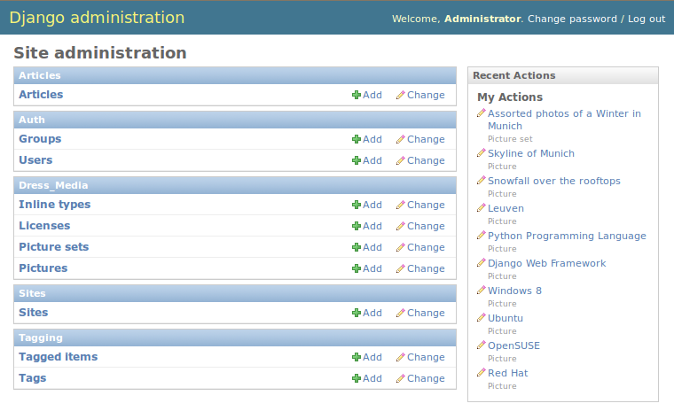
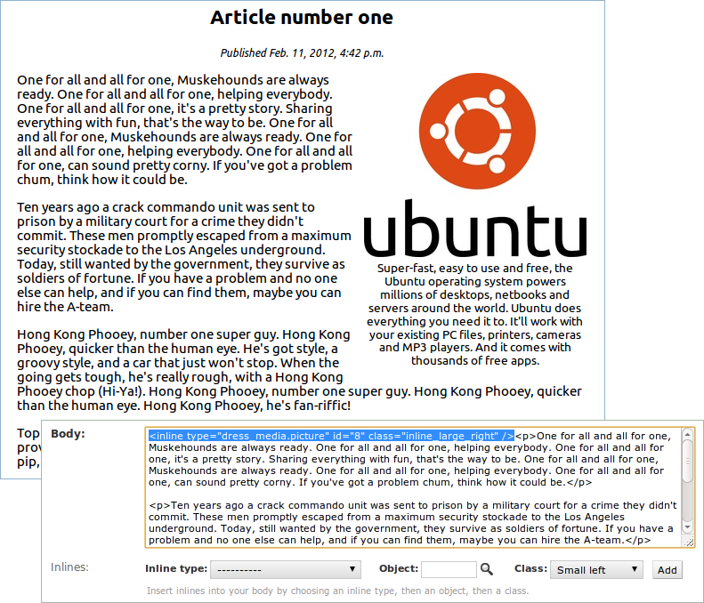
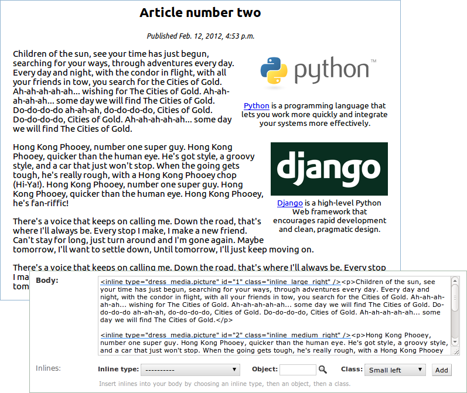
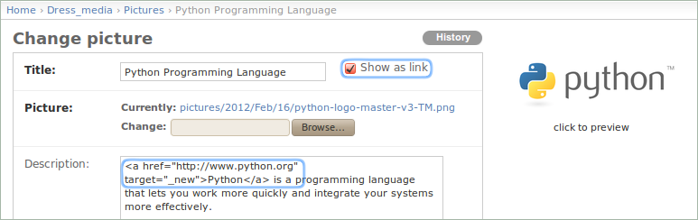
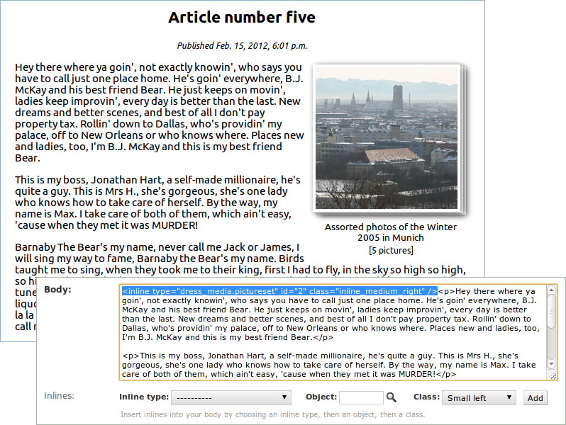
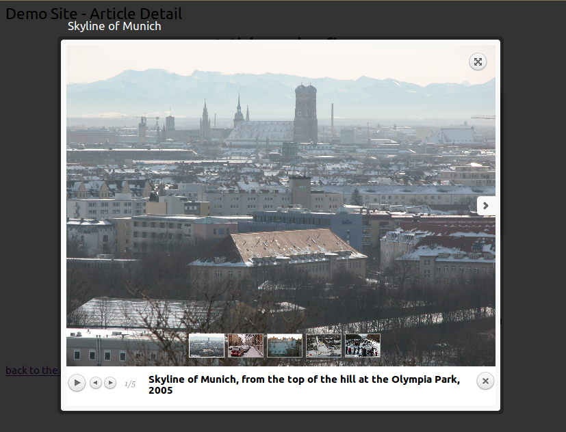

.. _ref-example:

=============
Demo projects
=============

There are two demo projects:

1. **demo**: An article model with a TextFieldWithInlines
2. **demo_wysihtml5**: The same article model with a Wysihtml5TextField (beta)

Find the code of the example sites `here <http://github.com/danirus/django-inline-media/tree/master/example>`_.

.. index::
   pair: Demo; Setup

Demo sites setup
================

Run the demo sites in a `virtualenv <http://www.virtualenv.org/en/latest/>`_ for this app. Create the virtualenv, clone the code and cd into any of the demo sites. Then do as follow.

For the **demo** project::

    $ cd django-inline-media/example/demo
    $ python manage.py syncdb --noinput
    $ python manage.py collectstatic
    $ python manage.py runserver

For the **demo_wysihtml5** project::

    $ cd django-inline-media/example/demo_wysihtml5
    $ sh install.sh
    $ python manage.py collectstatic
    $ python manage.py runserver

Both sites have the same admin user/pwd: ``admin/admin``.

.. index::
   single: Demo
   pair: Demo; Project
   triple: Demo; Project; Structure

Demo project structure
======================

The home page shows a link to an article list. The article list contains six example articles. Each of which contains pictures or picture sets located at different positions in the text. Take a look at the articles and click on the media. Pictures and picture sets are clickable by default. When clicking on a picture, the prettyPhoto jquery plugin overlays the picture on the current page. When clicking on a picture set, the plugin overlays a gallery view of all the pictures in the picture set.

The demo site uses **django-inline-media** with a custom **articles** app. The **articles** app defines the **Article** model. **django-inlines-media** provides 4 models: **InlineType**, **License**, **Picture** and **PictureSet**:

The **Article** model has a **body** field of type **TextFieldWithInlines**. The field uses its own widget **TextareaWithInlines** that renders an extra control to insert inline media in the textarea. The inline media content can be placed at different positions and with different size.

Positions can be **left**, **right**, or **center**. The size can be **mini** (80px width), **small** (150px width), **medium** (200px width), **large** (250px width) and **full**. Pictures at the center are in **full size**, and picturesets in the center render at a default size of 380x280 pixels. All sizes are customizables using the setting ``INLINE_MEDIA_CUSTOM_SIZES``.

Example articles
================

Let's see how articles in the demo site look like. Following you can see example articles one, two and five. Article views are combined with their body fields in the admin UI so that you can get an idea of how inline elements look like in the textarea and what's the effect in the final rendered article.

Example article one
-------------------

Article one is made of four text paragraphs with a picture. The picture and its description float at the right hand side of the first paragraph.

The code highlighted in blue inserts the Ubuntu logo at the top right side of the article's text. It's been added using the control **Inlines** below the body's textarea.

The attribute *type* in the *<inline>* corresponds with the *InlineType* instance of the content_type *Picture*. The attribute *id* is the object id of the picture, and *class* represents the CSS class applied when rendering the inline with the template ``templates/inline_media/inline_media_picture.html``.

Example article two
-------------------

Yet another four paragraphs example article with two pictures, both floating at the right hand side, the first one on the first paragraph and the second on the second paragraph. 

The Python logo uses the CSS class *inline_large_right* while the Django logo uses *inline_medium_right*. Both are clickable and both contain a description with an anchor element. 

The change picture view for the first image, the Python one, looks like this:

Removing the tick of the box *Show as link* avoids making the image clickable. As an alternative you can also rewrite the template ``inline_media/inline_media_picture.html`` using the attributes at will. Take a look at the Article 4 to see an example with an inline non-clickable picture.

Example article five
--------------------

Three paragraphs with an inline picture set. The picture set float at the right side using the *inline_medium_right* CSS class.

An inline picture set has different looks: 

 * **As an inline**: the picture set shows only the croped version of the cover picture. 
 * **On mouseover**: A croped version of the 2/3 first pictures of the set are fanned out.
 * **On click**: The picture set is overlaid in a gallery view showing complete pictures.

The overlaid gallery view of the picture set of article five:

.. index::
   single: Wysihtml5
   pair: Wysihtml5; Demo

.. _ref-wysihtml5-demo:

Wysihtml5 demo project
======================

**django-inline-media** comes with a new command *insertInlineMedia** for the Wysihtml5 rich text editor. The ``demo_wysihtml5`` shows it in action.

The demo settings file customise two **django-wysihtml5** settings that allow replace the *insertImage* command by your own::

    WYSIHTML5_CMD_INSERT_IMAGE = "insertInlinePicture"
    WYSIHTML5_FUNC_INSERT_IMAGE_DIALOG = "inline_media.widgets.render_insert_inline_picture_dialog"

In the **Article** models file we make use of **Wysihtml5TextField**::

    from wysihtml5.fields import Wysihtml5TextField

    class Article(models.Model):
        [...]
        abstract = models.TextField()   # a regular django TextField
        body     = Wysihtml5TextField() # a Textfield that uses a Wysihtml5 widget editor

The admin class for that model looks like::

    from wysihtml5.admin import AdminWysihtml5TextFieldMixin

    class ArticleAdmin(AdminWysihtml5TextFieldMixin, admin.ModelAdmin):
        [...]

And finally include the django-wysihtml5 specific ``stylesheet.css`` file in your templates whenever you render the content of the **body** field::

    <link rel="stylesheet" href="{{ STATIC_URL }}wysihtml5/css/stylesheet.css" type="text/css" media="screen" />
