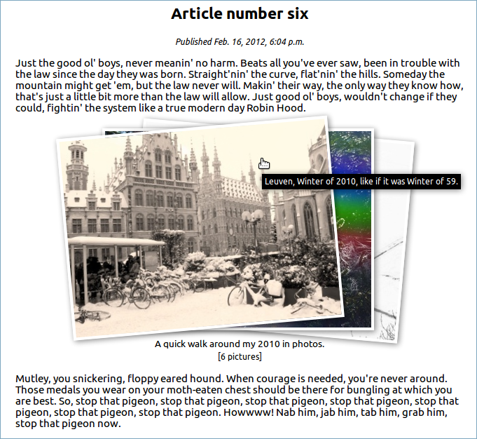

.. django-inlines-media documentation master file, created by
   sphinx-quickstart on Mon Dec 19 19:20:12 2011.
   You can adapt this file completely to your liking, but it should at least
   contain the root `toctree` directive.

Introducing Django inline-media
==============================

Insert inline media content in your text fields. Based on `django-basic-apps/inlines <https://github.com/nathanborror/django-basic-apps>`_.

Features:

1. An application to upload and insert pictures and collection of pictures into your texts.
2. Allows putting media at different positions and sizes (small/medium/large at left/right or full at the center).
3. Tag your pictures and picture sets, see their thumbnails and manage them easily using the Admin site.
4. TextFields in the Admin site show a customised control to insert inline media content.
5. Uses jquery `prettyPhoto <http://www.no-margin-for-errors.com/projects/prettyphoto-jquery-lightbox-clone/>`_ to show pictures and galleries when clicking on them.

The following sample shows a centered inline picture set inserted in a text, on mouseover event the first 3 photos unfold:

Run the demo project to see django-inline-media in action.

.. toctree::
   :maxdepth: 2

   example
   tutorial
   templatetags
   settings
   templates

Quick start
===========

1. Get the dependencies:

 * `Django Sorl-Thumbnail <http://thumbnail.sorl.net/>`_
 * `Django Tagging <http://code.google.com/p/django-tagging/>`_

2. Add the following entries in your ``settings.py``:

 * Add ``inline_media``, ``sorl.thumbnail`` and ``tagging`` to ``INSTALLED_APPS``.

 * Add ``THUMBNAIL_BACKEND = "inline_media.sorl_backends.AutoFormatBackend"``

 * Add ``THUMBNAIL_FORMAT = "JPEG"``

3. Create a model with a field of type ``TextFieldWithInlines``.

4. Create an admin class for that model by inheriting from both ``inline_media.admin.AdminTextFieldWithInlinesMixin`` and Django's ``admin.ModelAdmin``.

5. Optionally, customise inline_media templates by copying them from ``inline_media/templates/inline_media/`` to your ``inline_media/`` folder in your templates directory.

5. Run ``manage.py`` commands: ``syncdb``, ``collectstatic``, ``runserver``.

6. Create two `InlineType` objects, one for the `Picture` model and one for the `PictureSet` model.

7. Upload some pictures and create some picture sets.

8. Add content to the model using the field ``TextFieldWithInlines`` and see that you can insert inline content in the textarea. It will be rendered in the position indicated by the CSS class selected in the dropdown box.

9. Hit your App's URL!

Indices and tables
==================

* :ref:`genindex`
* :ref:`modindex`
* :ref:`search`

