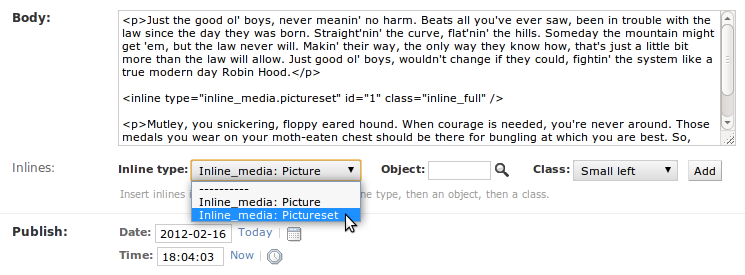

.. _ref-tutorial:

========
Tutorial
========

Django-inline-media is a simple reusable app that allows insertion of inline media content, so far pictures and picture sets, into texts.

.. index::
   single: Motivation

Motivation
==========

Django-inline-media help your users place images or collections of images as inlines in texts.

Any application used to write text that needs to insert inline pictures is a good candidate to adopt Django-inline-media. The app will render the text with inline pictures or picture sets, and when defined as clickable pictures will be overlayed in a bigger size on top of the page. 

Django-inline-media comes with two media models: Picture and PictureSet, but you can create your own inline types to support other media formats or providers (`oembed <http://oembed.com>`_ based content coming soon).

This tutorial explains how to install and configure django-inline-media, how to integrate it in your web project and how to use the widget. It additionally supports the `Wysihtml5 <http://xing.github.com/wysihtml5/>`_ rich text editor by providing a replacement for the Wysihtml5's ``insertImage`` command. See the **demo_wysihtml5** for details on this feature.

.. index::
   single: Installation

Installation
============

Check out the sources and add the app to your project or ``PYTHONPATH``.

Use git, pip or easy_install to check out django-inline-media from Github_ or get a release from PyPI_:

  1. Use **git** to clone the repository, and then install the package (read more about git_):

    * ``git clone git://github.com/danirus/django-inline-media.git`` and

    * ``python setup.py install``

  2. Or use **pip** (read more about pip_):

    * Do ``pip install django-inline-media``, or

    * Edit your project's ``requirements`` file and append either the Github_ URL or the package name ``django-inline-media``, and then do ``pip install -r requirements``.

  3. Or use **easy_install** (read more about easy_install_): 

    * Do ``easy_install django-inline-media``

.. _Github: http://github.com/danirus/django-inline-media
.. _PyPI: http://pypi.python.org/
.. _pip: http://www.pip-installer.org/
.. _easy_install: http://packages.python.org/distribute/easy_install.html
.. _git: http://git-scm.com/

.. index::
   single: Configuration

Configuration
=============

Follow the steps:

1. Install required apps:

  * ``sorl.thumbnail``: http://pypi.python.org/pypi/sorl-thumbnail/
  * ``tagging``: http://pypi.python.org/pypi/tagging/

2. Add the following entries to your ``settings.py``:

 * Add ``inline_media``, ``sorl.thumbnail`` and ``tagging`` to ``INSTALLED_APPS``.
 * Add ``THUMBNAIL_BACKEND = "inline_media.sorl_backends.AutoFormatBackend"``
 * Add ``THUMBNAIL_FORMAT = "JPEG"``
 * Optionally add an extra setting to control where django-inline-media stores images (see :doc:`settings`). It has a sane default, so don't bother to much.

3. Run management commands:

   * ``python manage.py syncdb`` to create inline_media DB entities (License, Picture, PictureSet)
   * ``python manage.py collectstatic`` to copy CSS and JavaScript content from inline_media to your project's static directory

There are extra steps when planning to use the Wysihtml5 editor. Read on the specific :ref:`ref-wysihtml5-demo`.

.. index::
   single: inline-media

.. _using-label:

Using inline-media
==================

Using inline-media is pretty easy:

1. Decide which fields of your models will hold inline media content (the typical candidate: a ``body`` field of a blog ``Post`` model)

2. Change their type from **TextField** to **TextFieldWithInlines**. This change does not affect your models' table definition, but just the way fields are rendered.
 
3. Change the admin class of those models and make them inherit from **AdminTextFieldWithInlinesMixin**. Fields of type **TextfieldWithInlines** will be rendered as **TextareWithInlines**

Let's see it with an example: the Article model.

.. index::
   single: Code
   Pair: Example; Code

Example code
------------

The Article model, in the demo project, has a couple of fields of type TextField, ``abstract`` and ``body``. Only the field ``body`` will hold inline media content. Article definition will look as follow::

    from inline_media.fields import TextFieldWithInlines

    class Article(models.Model):
        title = models.CharField(max_length=200)
	slug = models.SlugField(unique_for_date='publish')
	abstract = models.TextField()
	body = TextFieldWithInlines()
	publish = models.DateTimeField(default=datetime.now)

The ArticleAdmin class will inherit from both, **AdminTextFieldWithInlinesMixin** and Django's **ModelAdmin**::

    from django.contrib import admin
    from inline_media.admin import AdminTextFieldWithInlinesMixin
    from demo.articles.models import Article

    class ArticleAdmin(AdminTextFieldWithInlinesMixin, admin.ModelAdmin):
	list_display  = ('title', 'publish')
	list_filter   = ('publish',)
	search_fields = ('title', 'abstract', 'body')
	prepopulated_fields = {'slug': ('title',)}
	fieldsets = ((None, 
		      {'fields': ('title', 'slug', 'abstract', 'body', 
				  'publish',)}),)

    admin.site.register(Article, ArticleAdmin)

.. index::
   single: Types

In action
=========

Look at the admin site of the demo project. Click on any of the articles and see that the **inlines** field below the **body** allows you to choose between Picture and PictureSet:

Your articles detail template (``example/demo/templates/articles/article_detail.html``) loads the ``inlines`` templatetag and apply the ``render_inlines`` filter to the ``body`` field::

    
    ...

    

      {{ object.body|render_inlines }}
    

You can also customize inline-media templates for pictures and picture sets.
